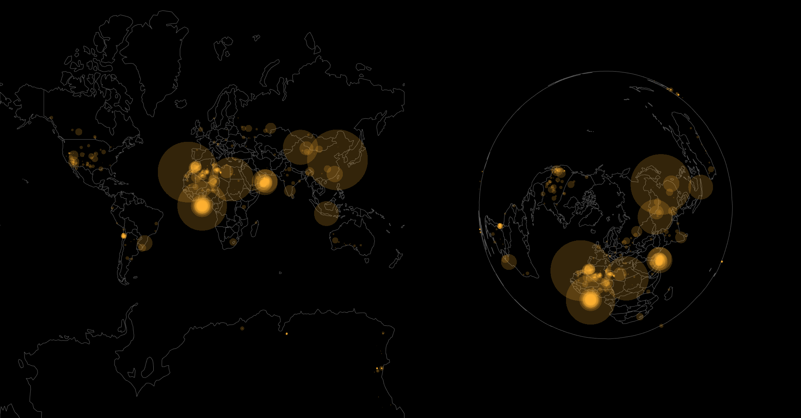

## WebGL meteorites map

---

- Decoding Protocol buffers (MVT) from CARTO Maps API
- Typed arrays and buffer data
- Rendering data with a WebGL context
- Writing Vertex Shaders and Fragments with GLSL
- Map projections with PostGIS

